# TradingAgents Web Console — Product and Engineering Specification

Status: implementation-ready MVP specification

Repository snapshot: `be952b8eccb49720509af544c6675233bc1f10d0` (main, merge labelled v0.4.2)

Specification date: 2026-09-11

## 1. Executive decision

Build a local-first **Streamlit web console** backed by a separate, durable analysis worker and a small SQLite job store. The browser must never own the lifetime of an analysis. A user may close the tab, return later, and find the run still queued, running, completed, failed, or resumable.

The product is a research and decision console. It runs the existing TradingAgents graph and presents its research, debates, proposed transaction, risk review, and final five-tier rating. It **does not place an order with a broker or exchange**. The UI must never label an action as “Execute trade,” “Place order,” or otherwise imply live trading.

Streamlit is the recommended MVP framework because this repository is Python-only, its outputs are Markdown/data tables, and Streamlit provides forms, multipage navigation, session state, independently refreshing fragments, and a documented Docker path. Its script-rerun model means it must remain a view/controller over durable state, not the run executor. See the official documentation for [execution flow](https://docs.streamlit.io/develop/api-reference/execution-flow), [fragments](https://docs.streamlit.io/develop/api-reference/execution-flow/st.fragment), [client/server behavior](https://docs.streamlit.io/develop/concepts/architecture/architecture), and [Docker deployment](https://docs.streamlit.io/deploy/tutorials/docker).

Reflex is a credible later choice if the project prioritizes a highly customized application shell, dynamic routes, or richer client interactions. It compiles a React/Next.js frontend and runs Python logic on a FastAPI backend over WebSockets, supports background events, and can self-host with Docker. That is more application machinery than this MVP needs, and its background events would still not replace a durable run queue. See [how Reflex works](https://reflex.dev/docs/advanced-onboarding/how-reflex-works), [background tasks](https://reflex.dev/blog/unlocking-new-workflows-with-background-tasks), and [self-hosting](https://reflex.dev/docs/hosting/self-hosting).

### Framework comparison

| Criterion | Streamlit | Reflex | Decision |
|---|---|---|---|
| Fast delivery for Python/Markdown/data UI | Excellent | Good | Streamlit |
| Existing repository fit | Direct | Adds compiled frontend and backend concepts | Streamlit |
| Live progress | Poll durable state with `st.fragment(run_every=...)` | Native WebSocket state updates | Either |
| Long-running run durability | External worker required | External worker still recommended | Tie |
| Fine-grained layout and app-like routing | Adequate | Better | Reflex |
| Docker Compose simplicity | One UI runtime plus worker | Frontend/backend build plus worker | Streamlit |
| Likely MVP maintenance burden | Lower | Higher | Streamlit |

Revisit Reflex only if Streamlit blocks an approved UX requirement. The runtime, persistence, and event contracts below deliberately keep the frontend replaceable.

## 2. Product goal and boundaries

### Goal

Let an operator configure, start, observe, recover, revisit, and export TradingAgents analyses from a browser while the system runs under Docker Compose.

### Primary operator

A technically comfortable, single trusted operator running TradingAgents on a workstation, home server, or private network. Multi-user SaaS is not an MVP assumption.

### MVP outcomes

The operator can:

1. Verify that the system, storage, selected LLM provider, and required credentials are ready.
2. Configure the same meaningful inputs offered by the interactive CLI.
3. Submit an analysis without tying it to a browser session.
4. Follow agent status, tool activity, reports, token counts, and elapsed time while it runs.
5. Cancel after the current graph operation, retry a failed run, or resume a compatible checkpoint.
6. Reopen completed runs and download their Markdown report tree, JSON final state, and diagnostic log.
7. Review the decision memory journal without editing its source file.
8. Run the CLI and web console against the same persistent Docker volume.

### Explicit non-goals for MVP

- No live brokerage, simulated exchange, order routing, or account connectivity.
- No claim that a rating is financial advice; retain the repository disclaimer.
- No autonomous scheduling, alerting, watchlists, or recurring scans.
- No multi-date backtest builder or performance analytics engine.
- No portfolio positions, P&L ledger, tax lots, or risk limits tied to real holdings.
- No concurrent graph execution inside one Python process.
- No public-internet deployment without an external authenticated TLS reverse proxy.
- No editing of raw decision-memory entries from the UI.
- No attempt to render or expose hidden chain-of-thought. Only existing messages, tool events, reports, and structured decisions are shown.

## 3. Repository findings

The authoritative upstream is [TauricResearch/TradingAgents](https://github.com/TauricResearch/TradingAgents). This specification is based on the checked-out fork and commit named above, not on assumptions from the upstream README alone.

### Current runtime and UI surface

| Repository area | Current behavior | Required web mapping |
|---|---|---|
| `cli/main.py:get_user_selections` | Eight-step interactive questionnaire | One validated “New analysis” form with progressive disclosure |
| `cli/main.py:run_analysis` | Streams LangGraph chunks into a Rich live layout | Reusable streaming runner emits durable normalized events |
| `cli/main.py:MessageBuffer` | Tracks agents, reports, messages, tools, and progress | Persisted run projection read by the web UI |
| `cli/stats_handler.py` | Counts LLM calls, tool calls, input/output tokens | Live run metrics |
| `cli/utils.py` | Symbol validation/normalization, asset detection, analyst filtering, providers, regions, models, key checks, language | Shared domain services; do not import prompt code into the web layer |
| `tradingagents/default_config.py` | Environment-aware defaults, vendors, paths, model settings, round counts | Effective-config builder and Settings/Health display |
| `tradingagents/llm_clients/model_catalog.py` | Provider-specific quick/deep model options | Dynamic model selectors; do not duplicate catalog values in UI code |
| `tradingagents/llm_clients/api_key_env.py` | Provider-to-key environment mapping | Masked credential status and exact missing-key guidance |
| `tradingagents/graph/setup.py` | Sequential analyst pipeline, bull/bear debate, trader, three-way risk debate, portfolio manager | Stage stepper and agent cards in actual graph order |
| `tradingagents/graph/trading_graph.py` | Programmatic run, checkpoint lifecycle, memory resolution, JSON state log, decision log, signal extraction | Core execution adapter |
| `tradingagents/graph/checkpointer.py` | Per-ticker SQLite checkpoints keyed by ticker/date/graph signature | Resume status and checkpoint controls |
| `tradingagents/agents/utils/memory.py` | Append-only Markdown decisions, later realized returns/reflections | Read-only Memory page |
| `tradingagents/reporting.py` | Per-team Markdown files plus `complete_report.md` | Automatic artifacts and downloads |
| `docker-compose.yml` | Interactive CLI service plus optional Ollama profile | Preserve CLI and Ollama; add web and worker services sharing data |

### Important behavioral constraints

1. Analysts execute **sequentially**, in canonical order `market`, `social`, `news`, `fundamentals`. Parallel analyst execution was explicitly removed as a no-op configuration in the changelog.
2. The `social` wire key is retained for compatibility, but every user-facing label must say **Sentiment Analyst**.
3. Fundamentals is excluded for crypto. Canonical symbols ending in `-USD`, `-USDT`, `-USDC`, `-BTC`, or `-ETH` are treated as crypto after normalization.
4. The research debate alternates Bull and Bear for `2 × max_debate_rounds` responses, then the Research Manager decides.
5. The risk debate runs Aggressive, Conservative, Neutral for `3 × max_risk_discuss_rounds` responses, then the Portfolio Manager decides.
6. The final signal is one of `Buy`, `Overweight`, `Hold`, `Underweight`, `Sell`, or non-tradeable `REVIEW`. `REVIEW` is an error/review state, not a synonym for Hold.
7. A checkpoint is compatible only when ticker, date, selected analysts, debate rounds, risk rounds, and asset type match. The existing signature enforces this.
8. Dataflow configuration is module-global (`tradingagents.dataflows.config._config`). Different run configurations must not execute concurrently in the same Python process.
9. The current interactive CLI stream path is not lifecycle-equivalent to `TradingAgentsGraph.propagate()`: `propagate()` resolves pending outcomes, injects past memory, writes its JSON state log, and appends the decision; the manual CLI stream path does not perform all of those operations. The web implementation must create one reusable runner with the complete intended lifecycle rather than copy either path verbatim. Migrating the CLI to that runner is recommended in the same change or a follow-up.
10. The repository produces a transaction **proposal** and portfolio **decision**. No broker or exchange client is present in the analyzed runtime path.

## 4. Domain workflow

```mermaid
flowchart LR
    A[Configure analysis] --> B[Validate and queue]
    B --> C[Selected analysts, sequential]
    C --> D[Bull / Bear debate]
    D --> E[Research Manager]
    E --> F[Trader proposal]
    F --> G[Aggressive / Conservative / Neutral debate]
    G --> H[Portfolio Manager]
    H --> I[Rating or REVIEW]
    I --> J[Reports, JSON, decision memory]
```



The UI should expose the firm-like workflow without suggesting that each role is an independently running process. It is one LangGraph run with agent nodes and tool loops.

## 5. User pathways

### Path A — First-run readiness

1. Operator opens the console.
2. Dashboard shows worker heartbeat, writable storage, queue status, version/commit, and credential status.
3. If the default provider key is missing, “New analysis” is still accessible, but submission is blocked with the exact required environment variable.
4. Operator opens Settings, enters or configures a credential, or updates the Compose `.env` and restarts.
5. Readiness changes to “Ready” without ever displaying the secret value.

Success: a new operator knows what is missing before paying the cost of a failed graph initialization.

### Path B — Run a standard stock analysis

1. Operator selects “New analysis.”
2. Enters `AAPL`; on “Review configuration,” the server shows canonical `AAPL` and detected type `Stock`.
3. Picks an as-of date no later than the server’s current date.
4. Chooses output language and at least one analyst.
5. Chooses shallow/medium/deep research depth.
6. Chooses provider, quick model, deep model, and any provider-specific reasoning control.
7. Reviews a configuration summary and selects “Queue analysis.”
8. App creates one durable run and navigates to its detail page.

Success: the run exists independently of the tab and has an immutable, secret-free configuration snapshot.

### Path C — Run a crypto analysis

1. Operator enters `BTCUSD` or `BTC-USD`.
2. On “Review configuration,” the backend normalizes to `BTC-USD` and detects `Crypto`.
3. Fundamentals is removed from the selected set and disabled with an explanation.
4. Remaining steps match Path B.

Success: the graph and visible analyst list agree; no hidden Fundamentals node is shown.

### Path D — Monitor a live run

1. Run page shows queue/running state and current stage.
2. Agent cards transition through `pending`, `running`, `completed`, or `failed`.
3. Reports appear as each report field becomes available.
4. A chronological activity feed shows safe message summaries and tool calls.
5. Metrics update: agents, reports, LLM calls, tools, tokens in/out when available, elapsed time, and per-analyst wall time.
6. Operator may navigate elsewhere or close the tab.

Success: returning to the run page reconstructs the same view from durable records; no graph object is stored only in Streamlit Session State.

### Path E — Failure, cancellation, and resume

1. On a failure, the run page shows the failed stage, a human-readable error, and a diagnostic-log download.
2. If a compatible checkpoint exists, primary action is “Resume from checkpoint.” This creates a new run record linked to the failed/cancelled run, then consumes the compatible checkpoint; the original attempt remains immutable.
3. If none exists, primary action is “Retry as new run.”
4. “Retry as new run” copies the previous configuration into a new immutable run ID but deliberately ignores the checkpoint.
5. “Cancel” sets `cancel_requested`. The worker checks it between graph chunks and stops after the current LLM/tool operation returns. It retains partial reports and a checkpoint when checkpointing is enabled.
6. “Start fresh” requires explicit confirmation, clears only the selected run’s compatible checkpoint, never all checkpoint databases, and creates a linked new run.

Success: recovery choices are honest about whether work will resume or restart.

### Path F — Reopen and export a completed decision

1. Operator opens Runs and filters by ticker, date, status, rating, or provider.
2. Opens a completed run.
3. Sees the final rating first, then executive decision, trader proposal, research debate, analyst reports, risk debate, and audit activity.
4. Downloads `complete_report.md`, the report-tree ZIP, final-state JSON, or redacted activity log.
5. Selects “Run again” to prefill a new form without mutating the original run.

Success: a completed analysis is useful without terminal access.

### Path G — Review decision memory

1. Operator opens Memory.
2. Filters entries by ticker, pending/resolved status, date, or rating.
3. A resolved entry shows raw return, benchmark alpha, holding window, resolution date, decision, and reflection.
4. A pending entry explains that the full five-trading-day outcome window has not yet resolved or that data remains unavailable.

Success: the UI is a read-only interpretation of `TradingMemoryLog.load_entries()` and never rewrites the Markdown log.

### Path H — Use Ollama in Compose

1. Operator starts the Compose `ollama` profile and pulls a model separately.
2. Selects Ollama in New analysis.
3. UI shows the resolved service endpoint, normally `http://ollama:11434/v1` inside Compose.
4. Operator selects a catalog model or enters a custom pulled model ID.
5. Health check warns if the endpoint is unreachable or model is not known locally, without sending a paid/completion request.

Success: the web worker, not the user’s browser, resolves the internal Compose hostname.

## 6. Information architecture

Use Streamlit’s current navigation API or a conventional multipage app. These are logical pages; dynamic path routing is not an MVP requirement.

### 6.1 Dashboard

- Primary action: **New analysis**.
- Active and queued runs with status, ticker, date, current stage, and elapsed time.
- Recent completed decisions with rating badges.
- System readiness: worker, database, storage, default provider, optional Ollama.
- Announcement banner using the existing announcement service, with short timeout and silent fallback.
- Permanent “research only / not financial advice / no orders are placed” notice.

Empty state: explain what an analysis produces and link to Settings/Health.

### 6.2 New analysis

One form, divided into four visual sections:

1. Instrument — ticker, normalized identity/type, as-of date, output language.
2. Team — selected analysts and depth preset.
3. Models — provider/region, endpoint where applicable, quick/deep model, reasoning control.
4. Reliability — checkpoint toggle and collapsed advanced settings.

The form’s submit action is **Review configuration**, not queue. It validates and canonicalizes the draft, derives asset type, removes invalid analyst choices, and shows a final summary. A separate **Queue analysis** button creates the job exactly once using an idempotency token. Streamlit widget changes inside the form must never queue work.

### 6.3 Run detail

Header:

- Canonical ticker, resolved instrument identity when available, asset type, as-of date.
- Run status and final rating badge when available.
- Created/started/finished timestamps and elapsed time.
- “Resumed from checkpoint” banner where applicable.

Body:

- Stage stepper: Analysts → Research → Trader → Risk → Portfolio.
- Agent-status grid.
- Tabs: Overview, Reports, Debate, Activity, Configuration, Artifacts.
- Live fragments poll at approximately one second while queued/running and stop polling in terminal states.

Actions:

- Queued/running: Cancel.
- Failed/cancelled: Resume when compatible; Retry as new run; Start fresh with confirmation.
- Completed: Run again; download artifacts.

### 6.4 Runs

- Default newest-first table.
- Filters: ticker, as-of date range, created date range, status, signal/rating, provider.
- Columns: ticker, as-of date, status, rating, provider, models, analysts, depth, duration, created time.
- Row opens Run detail.
- MVP does not delete run records. Retention/deletion is an administrative follow-up because it is destructive and must include artifact cleanup rules.

### 6.5 Memory

- Read-only table/detail view from the configured global memory log.
- Clearly distinguish trade date from outcome resolution date.
- Explain “raw return” and “alpha vs benchmark.”
- Preserve `REVIEW`/rating text as stored; do not silently coerce a missing value for display.

### 6.6 Settings and Health

Sections:

- Effective defaults with source labels: built-in, environment, or web setting.
- LLM credential names and status only; secret values are write-only.
- Provider endpoint and Ollama reachability.
- Data vendor choices and required-key warnings.
- Storage paths, free/writable check, database status, worker heartbeat, queue length.
- App/repository version and commit.
- Advanced defaults for rounds, temperature, retry budget, output-token cap, checkpointing, benchmark, and news limits.

Do not expose a raw environment dump.

## 7. New-analysis field contract

### Core fields

| Field | Control | Default | Validation and behavior | Runtime mapping |
|---|---|---|---|---|
| Ticker | Text | `SPY` | Trim; max 32; only alphanumeric plus `._-^=`; normalize on server | `company_name` |
| Canonical ticker | Read-only | Derived | Use `normalize_symbol`; never normalize only in browser | Stored and passed to graph |
| Asset type | Read-only badge | Derived | Use shared asset detector | `asset_type` |
| As-of date | Date picker | Today | ISO date; cannot be in future relative to server timezone | `trade_date` |
| Output language | Select + custom | English | Existing language list; custom must be non-empty | `output_language` |
| Analysts | Multi-select | All valid | At least one; canonical order; no Fundamentals for crypto | `selected_analysts` |
| Research depth | Radio | Shallow | Shallow=1, Medium=3, Deep=5 | Both debate and risk rounds unless advanced override |
| Provider | Select | Effective default | Must exist in shared provider registry | `llm_provider` |
| Region | Conditional select | Provider default | Qwen, GLM, and MiniMax use separate international/China provider keys and URLs | provider key + `backend_url` |
| Backend URL | Conditional text | Registry/env | Required for generic OpenAI-compatible; must start `http://` or `https://` | `backend_url` |
| Quick model | Select/custom | Catalog default | Catalog by provider; Azure and custom-only providers require text | `quick_think_llm` |
| Deep model | Select/custom | Catalog default | Same rule as quick | `deep_think_llm` |
| Reasoning control | Conditional | Provider default | OpenAI low/medium/high; Google minimal/high; Anthropic low/medium/high | Provider-specific config key |
| Checkpoint recovery | Toggle | Effective default; recommend on in web preset | Explain that this is crash recovery, not ordinary history | `checkpoint_enabled` |

### Advanced fields

| Field | Validation | Runtime mapping |
|---|---|---|
| Debate rounds | Integer 1–10 | `max_debate_rounds` |
| Risk rounds | Integer 1–10 | `max_risk_discuss_rounds` |
| Temperature | Empty or finite float in provider-accepted range; UI guidance 0–2 | `temperature` |
| LLM retry budget | Empty or integer ≥ 0 | `llm_max_retries` |
| Max output tokens | Empty or integer > 0 | `max_tokens` |
| Benchmark ticker | Empty or valid ticker | `benchmark_ticker` |
| Core/technical/fundamental/news vendor chain | Ordered supported values only | `data_vendors` |
| Macro vendor | `fred` or disabled | `data_vendors.macro_data` |
| Prediction-market vendor | `polymarket` or disabled | `data_vendors.prediction_markets` |

“Disabled” optional vendors require a defined runtime representation before implementation; do not send an empty vendor string into the current router. If the implementation does not add a disabled sentinel, omit those controls in MVP and preserve defaults.

### Provider behavior

- Use a new public provider registry extracted from `cli.utils._llm_provider_table`; do not depend on a private CLI helper.
- Use `get_model_options(provider, mode)` as the source for curated choices.
- OpenRouter may fetch current models server-side; if the request fails, retain custom model ID entry.
- Azure uses deployment names rather than catalog model IDs.
- Bedrock uses a user-provided model/inference-profile ID and AWS region. Authentication may be a Bedrock bearer token or AWS credential chain.
- Ollama and generic OpenAI-compatible endpoints may be keyless.
- Display the exact key variable named by `get_api_key_env(provider)` when a required key is absent.
- Never validate a paid provider by sending a completion. Constructor validation and non-billable endpoint checks are sufficient for MVP.

### Configuration precedence

Build each run from a deep copy; never mutate `DEFAULT_CONFIG` or share nested dictionaries.

1. Built-in `DEFAULT_CONFIG` provides the base.
2. Existing environment overrides provide deployment defaults.
3. Persisted non-secret web defaults override those for new forms.
4. Explicit per-run form values override defaults.
5. Server-controlled paths and secret locations are never per-run fields.

Show the effective value and source in Settings. This intentionally treats environment values as operator defaults rather than silently locking the form. If deployments require locked fields later, add an explicit allowlist such as `TRADINGAGENTS_WEB_LOCKED_FIELDS`; do not infer locks merely because an environment variable exists.

## 8. Run lifecycle and reusable runner

Create a framework-neutral runtime service, tentatively `tradingagents.runtime.AnalysisRunner`. Streamlit, the worker, tests, and eventually the CLI should consume it.

### Required lifecycle

1. Validate the request and canonicalize ticker/asset type.
2. Materialize and persist a secret-free effective-config snapshot.
3. Load configured secrets into the isolated run process.
4. Instantiate `TradingAgentsGraph` and stats callback.
5. Resolve pending same-ticker memory outcomes.
6. Load point-in-time-safe past context.
7. Resolve instrument identity/context once.
8. Create initial state including `past_context` and `instrument_context`.
9. Begin checkpoint scope and persist whether the run is fresh or resumed.
10. Stream graph chunks and merge them into cumulative state.
11. Convert each chunk into normalized events, report updates, stage status, and metrics.
12. Check `cancel_requested` between chunks. A cooperative cancellation must not append a completed decision.
13. On success:
    - validate/extract final signal;
    - write final-state JSON;
    - append the decision to memory exactly once;
    - write the report tree automatically;
    - clear only the successful run’s checkpoint;
    - mark the run completed in one final persistence transaction.
14. On failure:
    - keep any compatible checkpoint;
    - preserve partial reports/events;
    - store a redacted error and diagnostic traceback file;
    - mark failed.
15. Always close the checkpoint context and release worker ownership.

Private methods such as `_resolve_pending_entries`, `_memory_as_of`, and `_log_state` should be made public or moved behind the runner. New UI code should not accumulate calls to private graph internals.

### Normalized event types

| Type | Required payload |
|---|---|
| `run_status` | status, stage, message |
| `checkpoint` | enabled, resumed, step when known |
| `agent_status` | agent key, display name, team, status |
| `message` | source class, safe content, agent when known |
| `tool_call` | tool name, redacted arguments, agent when known |
| `report_update` | report key, producer, content revision |
| `debate_update` | debate kind, speaker, round/count, appended content |
| `stats` | LLM calls, tool calls, tokens in/out, elapsed seconds |
| `artifact` | kind, safe relative path, size |
| `error` | public error type/message, diagnostic reference |

Events must have a monotonically increasing sequence per run. Message IDs should be deduplicated as the CLI currently does. Persist full report content separately; events may reference a report revision to avoid duplicating large Markdown strings on every poll.

### Stage and completion projection

| Stage | Producers | Completion evidence |
|---|---|---|
| Analysts | Selected analyst nodes | Corresponding report field has content after producer node finishes |
| Research | Bull, Bear, Research Manager | `investment_debate_state.judge_decision` and `investment_plan` |
| Trader | Trader | `trader_investment_plan` |
| Risk | Aggressive, Conservative, Neutral | Risk histories reach configured count |
| Portfolio | Portfolio Manager | `risk_debate_state.judge_decision` and `final_trade_decision` |

Never mark every agent completed merely because streaming ended. On an exception, the active agent is failed and later agents remain pending.

## 9. Persistence model

Use SQLite for MVP at `${TRADINGAGENTS_HOME}/webui/tradingagents_web.db`, with WAL mode, foreign keys, busy timeout, and explicit migrations. It is suitable for a local single-worker Compose deployment. Do not place this database on NFS/SMB.

### `runs`

- `id` UUID text primary key
- `parent_run_id` nullable UUID for resume/retry/rerun lineage
- `ticker_input`, `ticker`, `asset_type`, `trade_date`
- `status`: `queued`, `running`, `cancel_requested`, `cancelled`, `completed`, `failed`
- `stage`, `active_agent`
- `signal` nullable; includes `REVIEW`
- `config_json` sanitized immutable snapshot
- `config_hash` for duplicate warning and checkpoint compatibility display
- `checkpoint_enabled`, `resumed_from_checkpoint`, `checkpoint_step`
- `created_at`, `started_at`, `finished_at`, `heartbeat_at`
- `llm_calls`, `tool_calls`, `tokens_in`, `tokens_out`
- `error_type`, `error_message`, `diagnostic_path`
- `artifact_root`, `final_state_path`, `complete_report_path`
- `app_version`, `repository_commit`

### `run_events`

- `id` integer primary key
- `run_id` foreign key
- `sequence` unique within run
- `created_at`
- `type`, `agent`, `payload_json`

Index `(run_id, sequence)`.

### `run_reports`

- `run_id` foreign key
- `report_key`
- `producer`
- `content`
- `revision`
- `updated_at`

Primary key `(run_id, report_key)`.

Report keys include:

- `market_report`
- `sentiment_report`
- `news_report`
- `fundamentals_report`
- `bull_history`
- `bear_history`
- `research_manager_decision`
- `investment_plan`
- `trader_investment_plan`
- `aggressive_history`
- `conservative_history`
- `neutral_history`
- `portfolio_manager_decision`
- `final_trade_decision`

### `web_settings`

Store only non-secret defaults as key/value JSON with update time. Validate against an allowlist.

### Worker lease

Maintain one heartbeat/lease record or equivalent metadata so the UI can distinguish “queued behind an active run” from “worker unavailable.” On startup, a worker should inspect stale `running` jobs. Mark them failed with a recovery explanation or requeue only when a compatible checkpoint exists and automatic recovery is explicitly enabled.

### File layout

```text
~/.tradingagents/
├── cache/                         # existing data cache and checkpoints
├── memory/trading_memory.md       # existing global decision memory
└── webui/
    ├── tradingagents_web.db
    ├── secrets.env                # optional write-only web secret store, mode 0600
    └── runs/<run-id>/
        ├── activity.log           # redacted
        ├── diagnostic.log         # server-only unless explicitly downloaded
        ├── final_state.json
        └── reports/
            ├── complete_report.md
            ├── 1_analysts/...
            ├── 2_research/...
            ├── 3_trading/...
            ├── 4_risk/...
            └── 5_portfolio/...
```

Web-run history is sourced from the job database. Discovering/importing legacy CLI output folders is a post-MVP feature.

## 10. Background execution and concurrency

### MVP worker

- A dedicated worker process claims queued runs using an atomic SQLite transaction.
- Default concurrency is one.
- Each claimed analysis runs in an isolated child process so a bad provider client or module-global dataflow config cannot corrupt the web process.
- The worker and web process communicate only through the database and shared artifact volume.
- The worker reloads secrets for each new child, so credential changes do not require exposing keys through job records.
- Queue submission is idempotent against double-clicks. Use a client-generated submission token or database uniqueness constraint.

### Why not a Streamlit background thread

Streamlit sessions rerun and are tied to browser WebSocket sessions. Session State is useful for view state, but it is not a durable job record. A thread cached inside the Streamlit process would make restart, reconnect, error recovery, and multi-session behavior ambiguous. Streamlit should enqueue and poll; it should not execute the graph.

### Cancellation

MVP cancellation is cooperative:

1. UI sets `cancel_requested`.
2. Runner checks after each streamed chunk.
3. The currently blocking LLM or vendor call is allowed to return.
4. Runner raises a dedicated cancellation outcome, preserves partial state/checkpoint, and marks `cancelled`.

Do not use hard process kill as the normal cancel button. It can interrupt a checkpoint or artifact write. A force-stop administrative action may be designed later.

## 11. Secrets and security

### Default deployment posture

- Bind Compose port `8501` to `127.0.0.1` by default.
- If remote access is needed, place the app behind an authenticated TLS reverse proxy.
- Streamlit itself is not the authorization boundary for MVP.

### Secret handling

- Compose `.env` remains the preferred source.
- Optionally support write-only entry into `~/.tradingagents/webui/secrets.env`, chmod `0600`, on a clearly marked trusted-admin Settings page.
- Return only `configured: true/false`, source, and last-updated time to the UI.
- Never place secrets in `runs.config_json`, events, logs, exception text, URLs, query parameters, or downloads.
- Redact values for all keys matching known API-key environment names plus generic patterns such as `*_KEY`, `*_TOKEN`, `PASSWORD`, and `AUTHORIZATION`.
- Do not echo the last characters of a key; presence is enough.
- Avoid `unsafe_allow_html=True` when rendering model-authored Markdown.
- Sanitize all downloadable file targets by resolving them under the run’s artifact root.

### Financial safety copy

Every final decision page and export header should state:

> Research output only. TradingAgents does not place an order from this console. This is not financial, investment, or trading advice.

## 12. Docker Compose specification

Preserve the existing interactive CLI service and optional Ollama services. Add:

### `tradingagents-web`

- Built from the repository with a `web` dependency extra.
- Starts `python -m streamlit run tradingagents/web/app.py --server.address=0.0.0.0 --server.port=8501`.
- Publishes `${TRADINGAGENTS_WEB_BIND:-127.0.0.1}:8501:8501`.
- Uses `.env` and mounts `tradingagents_data:/home/appuser/.tradingagents`.
- Health check: `/_stcore/health`.
- Does not depend on Ollama unless the optional profile is selected.

### `tradingagents-worker`

- Uses the same built image and `.env`.
- Starts the queue worker module, not the Typer entrypoint.
- Mounts the same `tradingagents_data` volume.
- Has a restart policy appropriate for local service use, such as `unless-stopped`.
- Writes a heartbeat visible to the web service.

### Existing CLI

- `docker compose run --rm tradingagents` continues to open the interactive CLI.
- CLI and worker share cache, checkpoints, memory, and output volume.
- Document that running CLI and web analyses at the same time may still contend on the shared memory log. Until file locking is added, recommend one active analysis across both entry points.

### Ollama profile

- Worker receives `OLLAMA_BASE_URL=http://ollama:11434/v1` when launched in the Ollama profile.
- Web health checks must be performed from the server/worker network, not from browser JavaScript.

### Packaging

Add a `web` optional dependency group in `pyproject.toml`, initially including a compatible pinned range such as `streamlit>=1.63,<2`. The Docker image may install `.[web]`; local library users should not be forced to install Streamlit.

## 13. Suggested source layout

```text
tradingagents/
├── runtime/
│   ├── models.py              # RunRequest, event and status types
│   ├── config_builder.py      # deep-copy precedence and validation
│   ├── analysis_runner.py     # complete graph lifecycle and event emission
│   ├── stats.py               # reusable callback metrics
│   └── worker.py              # durable queue consumer
├── persistence/
│   ├── database.py            # connection setup and migrations
│   ├── run_repository.py
│   └── secret_store.py
├── llm_clients/
│   └── provider_catalog.py    # public provider/region/endpoint metadata
└── web/
    ├── app.py
    ├── pages/
    │   ├── dashboard.py
    │   ├── new_analysis.py
    │   ├── run_detail.py
    │   ├── runs.py
    │   ├── memory.py
    │   └── settings.py
    └── components/
        ├── agent_status.py
        ├── rating.py
        ├── report_viewer.py
        └── system_health.py
```

Avoid importing `cli.main` from the web application. Move reusable non-interactive behavior into `tradingagents.runtime` or other package modules and leave Typer/Questionary/Rich as CLI adapters.

## 14. API-level Python contracts

These examples define intent; names may change, but equivalent typed boundaries are required.

```python
@dataclass(frozen=True)
class RunRequest:
    ticker: str
    trade_date: str
    asset_type: Literal["stock", "crypto"]
    analysts: tuple[Literal["market", "social", "news", "fundamentals"], ...]
    output_language: str
    llm_provider: str
    quick_think_llm: str
    deep_think_llm: str
    backend_url: str | None
    max_debate_rounds: int
    max_risk_discuss_rounds: int
    checkpoint_enabled: bool
    google_thinking_level: str | None = None
    openai_reasoning_effort: str | None = None
    anthropic_effort: str | None = None
    temperature: float | None = None
    llm_max_retries: int | None = None
    max_tokens: int | None = None
    benchmark_ticker: str | None = None
```

```python
class EventSink(Protocol):
    def emit(self, run_id: str, event: RunEvent) -> None: ...
    def cancellation_requested(self, run_id: str) -> bool: ...
```

```python
class AnalysisRunner:
    def run(self, run_id: str, request: RunRequest, sink: EventSink) -> RunResult: ...
```

`RunResult` must contain final state, signal, artifact references, metrics, and whether the run resumed. It must not contain secrets.

## 15. Report and decision presentation

### Final overview order

1. Final rating badge or REVIEW warning.
2. Portfolio Manager decision.
3. Trader transaction proposal.
4. Research Manager recommendation.
5. Evidence completeness: which analyst reports were selected/completed.
6. Run metadata and disclaimer.

### Full report order

1. Market Analyst
2. Sentiment Analyst
3. News Analyst
4. Fundamentals Analyst when selected
5. Bull Researcher history
6. Bear Researcher history
7. Research Manager decision/investment plan
8. Trader proposal
9. Aggressive risk history
10. Conservative risk history
11. Neutral risk history
12. Portfolio Manager/final decision

The existing Markdown is the source of truth. The UI may parse deterministic headers for badges—rating, sentiment band/score/confidence, trader action—but must always retain the raw rendered report and degrade gracefully when a provider falls back to free text.

### Rating display

| Signal | Display intent |
|---|---|
| Buy | Strong positive badge |
| Overweight | Positive badge |
| Hold | Neutral badge |
| Underweight | Caution badge |
| Sell | Negative badge |
| REVIEW | Amber error/review panel; never style as Hold |

Color must not be the only indicator; include text and icon/shape.

## 16. Error behavior

Translate common errors into actionable public messages while retaining full server diagnostics:

| Condition | Public behavior |
|---|---|
| Missing provider key | Name exact environment variable and link to Settings |
| Invalid ticker characters/date | Inline form error; do not queue |
| No/stale market data | Explain canonical symbol and configured vendor result |
| Vendor not configured/rate-limited | Name vendor/category; show retry guidance |
| Endpoint unreachable | Show server-resolved endpoint and connectivity failure |
| Unsupported model/provider | Preserve entered ID; show registry/catalog guidance |
| LLM rate limit | Mark failed/resumable; suggest retry budget or later retry |
| Unparseable final rating | Complete with `REVIEW` only if all graph outputs completed; prominently require human review |
| Worker heartbeat stale | Keep queued record; show worker unavailable and Compose guidance |
| App restart during running job | Reconcile stale lease and offer checkpoint recovery |

Do not expose raw tracebacks inline. Make a diagnostic download available only to the trusted operator and redact it first.

## 17. Testing and acceptance criteria

### Unit tests

- Ticker validation and canonicalization reuse current symbol behavior.
- Future dates cannot be submitted.
- Crypto removes Fundamentals before the request is persisted.
- At least one analyst is required and order is canonical.
- Provider/region/backend/model conditional fields build the correct config.
- Config building deep-copies nested vendor and benchmark maps.
- Environment/web/run precedence is deterministic and surfaced.
- Secrets never appear in serialized request, database records, events, or logs.
- Chunk reducer deduplicates message IDs and merges full final state.
- Agent/status projection does not mark pending agents completed on failure.
- `REVIEW` remains distinct from Hold.
- Event sequences are monotonic and report revisions are idempotent.

### Integration tests with a fake graph

- Queue → running → completed persists across a new browser session.
- Reports become visible incrementally in graph order.
- Closing the Streamlit session does not stop the fake run.
- Cancellation between chunks yields cancelled, no memory append, and partial artifacts.
- Failure retains a checkpoint; compatible resume feeds `None` and continues.
- Changed analyst/depth/asset config cannot resume an old checkpoint.
- Successful completion writes JSON, report tree, memory decision, and clears checkpoint exactly once.
- A retry creates a new run linked to the original and does not mutate history.
- A stale worker lease is detected on restart.

### Docker smoke tests

- `docker compose up --build tradingagents-web tradingagents-worker` reaches a healthy UI.
- A no-key deployment loads Dashboard and explains readiness instead of crashing.
- Shared run history survives container recreation.
- Existing `docker compose run --rm tradingagents` remains functional.
- Ollama profile resolves the service hostname from the worker container.
- Containers run as the existing non-root `appuser` and can write the shared volume.

### UX acceptance

- A first-time user can identify required setup without reading a traceback.
- A standard run can be configured from one page with advanced options collapsed.
- The browser can be closed for at least one minute and reopened to the same live run.
- The final rating and disclaimer are visible without scrolling through all reports.
- Every CLI live-layout datum has a web equivalent: agent progress, messages/tools, current report, report count, LLM/tool counts, token counts when supplied, and elapsed time.
- Every completed report section is readable and downloadable.
- No control implies order execution.

## 18. Delivery plan

### Milestone 1 — Runtime foundation

- Add public provider metadata and typed run request.
- Extract reusable stats and streaming lifecycle.
- Add event projection and tests.
- Close the CLI/programmatic lifecycle parity gap or document a temporary compatibility wrapper.

Exit: a fake or real runner can emit normalized events and produce the complete artifacts without UI code.

### Milestone 2 — Durable queue

- Add SQLite schema/migrations and repositories.
- Add single-worker claim/heartbeat/cancel/recovery behavior.
- Add child-process isolation and secret redaction.

Exit: a command can enqueue a run, worker completes it, and a second process can inspect it.

### Milestone 3 — Streamlit MVP

- Dashboard, New analysis, Run detail, Runs, Settings/Health.
- Live fragment polling and all report/artifact views.
- Read-only Memory page if it does not threaten the delivery window; otherwise ship immediately after MVP.

Exit: all core user pathways A–F work without terminal interaction after initial Compose startup.

### Milestone 4 — Compose and hardening

- Add web dependency extra, services, health checks, shared volume, docs.
- Docker smoke tests, restart/reconnect tests, accessibility pass, threat review.
- Preserve CLI and Ollama workflows.

Exit: definition of done below is met.

## 19. Definition of done

The web console is complete for MVP when:

1. It is launched with Docker Compose alongside the worker and optional Ollama.
2. It maps all interactive CLI run inputs and all live CLI output categories.
3. Runs continue when the browser disconnects and survive UI restarts.
4. Failed runs expose honest retry/resume behavior based on compatible checkpoints.
5. Successful runs automatically persist final state, full report tree, final signal, and decision memory once.
6. History and downloads work after container recreation.
7. Secrets are write-only/masked and absent from persisted run data and logs.
8. Existing CLI and programmatic APIs remain compatible.
9. Automated unit, integration, and Compose smoke tests pass without real API keys.
10. The UI clearly states that it performs research analysis and does not place trades.

## 20. Deferred product decisions

These require explicit product approval and should not be guessed during MVP implementation:

- Whether to add authenticated multi-user accounts and per-user credentials/history.
- Whether remote exposure is officially supported and which reverse proxy/auth stack is documented.
- Whether to add batch tickers, schedules, notifications, or watchlists.
- Whether broker/paper-trading execution will ever be in scope; that requires a separate safety and authorization design.
- Whether run retention/deletion is automatic and how it interacts with memory and checkpoints.
- Whether multiple isolated workers may run concurrently; file locking and same-ticker conflict rules must land first.
- Whether CLI legacy output should be imported into web history.
- Whether Reflex becomes preferable after the runtime contracts stabilize and UI customization needs are demonstrated.
